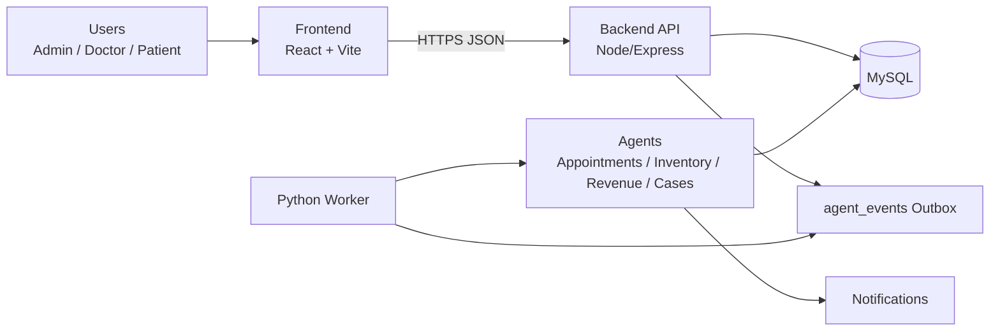
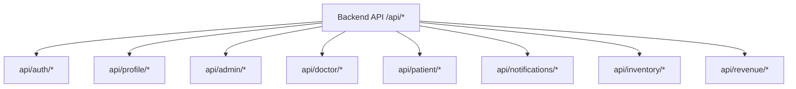
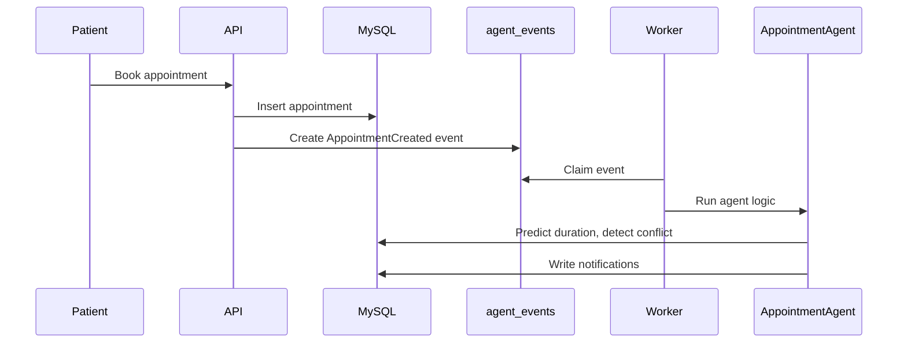
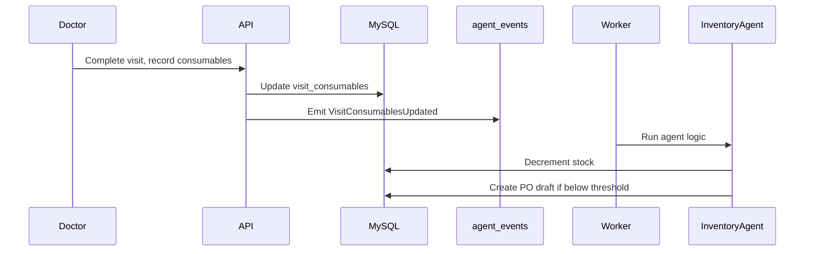
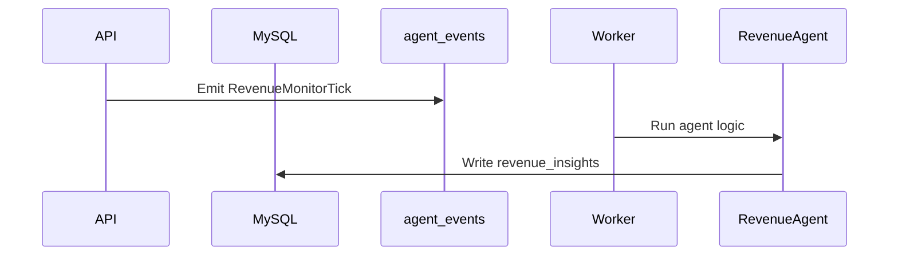

<div align="center">
  <h1>DentraOS</h1>
  <p>Agentic AI dental clinic intelligence platform with Admin, Doctor, and Patient portals.</p>
  <p>
    
    
    
    
    
    <a href="LICENSE"></a>
  </p>
  <p><strong>Built by Shashank Preetham Pendyala</strong></p>
</div>

---

## Overview

DentraOS is a production-grade dental clinic intelligence platform that unifies scheduling, cases, billing, inventory, and notifications across Admin, Doctor, and Patient roles. A Python worker consumes the `agent_events` outbox table to drive automation and optional AI tasks with traceable state changes.

Success is measured by:
- Appointment completion rate and time-to-schedule
- Inventory stock-out prevention and reorder accuracy
- Case resolution speed and notification SLA adherence
- Agent event processing reliability

---

## Table of Contents

- [Demo](#demo)
- [Features](#features)
- [Architecture](#architecture)
- [Layered Architecture](#layered-architecture)
- [Module Inventory](#module-inventory)
- [Tech Stack](#tech-stack)
- [Project Structure](#project-structure)
- [Backend API Map](#backend-api-map)
- [Workflow](#workflow)
- [Workflow Diagrams](#workflow-diagrams)
- [Data Model Summary](#data-model-summary)
- [Environment Variables](#environment-variables)
- [Setup and Run](#setup-and-run)
- [Run, Build, Test](#run-build-test)
- [Configuration](#configuration)
- [Deployment](#deployment)
- [Monitoring and Logging](#monitoring-and-logging)
- [Security Notes](#security-notes)
- [Troubleshooting](#troubleshooting)
- [Roadmap](#roadmap)
- [License](#license)

---

## Demo

- Walkthrough video: [demos/dentraos_demo.webm](demos/dentraos_demo.webm)

---

## Features

### Core
- Role-based experiences for Admin, Doctor, Patient
- Appointment lifecycle from booking to completion
- Notifications for patients, doctors, and admins
- Inventory management with auto-reorder drafts
- Revenue insights and invoice workflows

### Admin
- Operational dashboards and clinic configuration
- Appointment management and case tracking
- Inventory monitoring and purchase order drafts
- Revenue insights and alerts

### Doctor
- Daily schedule and appointment handling
- Patient record access and case summaries
- Alerts for conflicts, delays, and no-shows

### Patient
- Booking and appointment tracking
- Treatment and billing view
- Notifications and reminders

### Automation
- Appointment conflict detection and reschedule suggestions
- Low-stock detection and PO draft creation
- Case stage monitoring and summary updates

---

## Architecture

### System Overview



### Backend Modules View



---

## Layered Architecture

### Frontend Layer
- React + Vite SPA with role-based routing
- Shared components for forms, tables, charts, and modals
- Authentication guard for Admin, Doctor, Patient access

### Backend Layer
- Express API with role-scoped routes
- Validates requests, writes DB state, emits outbox events
- Uses a shared MySQL pool and consistent time zone handling

### Agent Layer
- Python worker pulls from `agent_events`
- Deterministic logic for scheduling, inventory, revenue, and cases
- Writes DB updates and notifications

### Database Layer
- MySQL schema covers all clinic data and agent operations
- Idempotency locks for safe retries
- Audit and notification logs for traceability

---

## Module Inventory

### Frontend
- `Frontend/src/AppRouter.tsx` role-based routes
- Admin, Doctor, Patient layouts and pages
- Shared components, forms, and tables

### Backend
- Auth and profile flows
- Appointment, case, inventory, billing
- Notifications and clinic settings
- Outbox event creation for agents

### Agents
- AppointmentAgent
- InventoryAgent
- RevenueAgent
- CaseTrackingAgent

---

## Tech Stack

- Frontend: React, Vite, TypeScript, Tailwind CSS
- Backend: Node.js, Express
- Agents: Python 3.7+, mysql-connector, dotenv
- Database: MySQL 8.x (MariaDB compatible)
- Testing: Playwright E2E

---

## Project Structure

- `Frontend/` UI for Admin, Doctor, Patient
- `Backend/` Express API server
- `Backend/dental_agents/` Python agent worker and modules
- `Backend/db/schema_query.sql` canonical schema

---

## Backend API Map

| Endpoint | Role | Purpose |
| --- | --- | --- |
| `api/auth/*` | All | Login, registration, role handling |
| `api/profile/*` | All | User profile updates |
| `api/admin/*` | Admin | Clinic settings, dashboards, inventory, revenue |
| `api/doctor/*` | Doctor | Appointments, cases, patients |
| `api/patient/*` | Patient | Booking, treatments, billing |
| `api/notifications/*` | All | In-app notifications |
| `api/inventory/*` | Admin | Inventory and vendor controls |
| `api/revenue/*` | Admin | Revenue insights and invoices |

---

## Workflow

### System Flow

1. User action triggers a backend API request
2. Backend writes DB state and emits an `agent_events` row
3. Python worker claims and processes the event
4. Agents update DB and create notifications
5. UI reads updated state and renders role-specific updates

### Event Pipeline

1. `agent_events` receives a `NEW` event
2. Worker locks event and marks `PROCESSING`
3. Agent executes domain logic
4. Event becomes `DONE` or `FAILED` with retries

---

## Workflow Diagrams

### Appointment Lifecycle



### Inventory Auto-Reorder



### Revenue Insight Flow



---

## Data Model Summary

Canonical schema is in `Backend/db/schema_query.sql` and includes:
- Users, roles, permissions
- Patients, doctors, clinic settings
- Appointments, visits, procedures
- Cases, timelines, summaries
- Inventory, vendors, usage logs
- Invoices, payments
- Notifications
- Agent outbox and idempotency
- Revenue insights
- Reschedule suggestions
- Purchase order drafts and items

---

## Environment Variables

Configured in `.env` at repo root:
- `DB_HOST`
- `DB_PORT`
- `DB_USER`
- `DB_PASSWORD`
- `DB_NAME`
- `JWT_SECRET`
- `VITE_API_BASE_URL`
- `ASSISTANT_URL`
- `OPENAI_API_KEY`
- `OPENAI_MODEL`

---

## Setup and Run

### Prerequisites

- Node.js 18+
- Python 3.7+
- MySQL 8.x or Docker

### Quick Start

1. Start MySQL (Docker)
2. Apply schema
3. Start backend
4. Start agents
5. Start frontend

---

## Run, Build, Test

```bash
docker run -d --name dental-mysql -e MYSQL_DATABASE=dental_clinic -e MYSQL_USER=dental_app -e MYSQL_PASSWORD=dental_app_pass -e MYSQL_ROOT_PASSWORD=rootpass -p 3307:3306 mysql:8.0
Get-Content Backend/db/schema_query.sql | docker exec -i dental-mysql mysql -h 127.0.0.1 -udental_app -pdental_app_pass dental_clinic
cd Backend; npm install; node server.js
cd Backend/dental_agents; python -m dental_agents.worker
cd Frontend; npm run dev
cd Frontend; npm run test:e2e
```

---

## Configuration

- Role-based routing in `Frontend/src/AppRouter.tsx`
- Outbox events written by backend and consumed by agents
- Timezone configured via `.env`

---

## Deployment

- Containerize backend and agents for production
- Use managed MySQL for persistence
- Serve frontend from a CDN or static host

---

## Monitoring and Logging

- Monitor `agent_events` for backlog and failures
- Track API latency on critical endpoints
- Review notification throughput for SLA compliance

---

## Security Notes

- JWT secret must be set in `.env`
- Never expose DB credentials
- Keep API keys in environment variables only

---

## Troubleshooting

- If agents do not process events, confirm worker is running
- If API fails, check DB connectivity and schema
- If UI is blank, verify `VITE_API_BASE_URL`

---

## Roadmap

- Admin UI for reschedule suggestions and PO drafts
- Deeper E2E flows with real data creation
- Optional AI assistant integration for case summaries

---

## License

MIT License. See [LICENSE](LICENSE).
